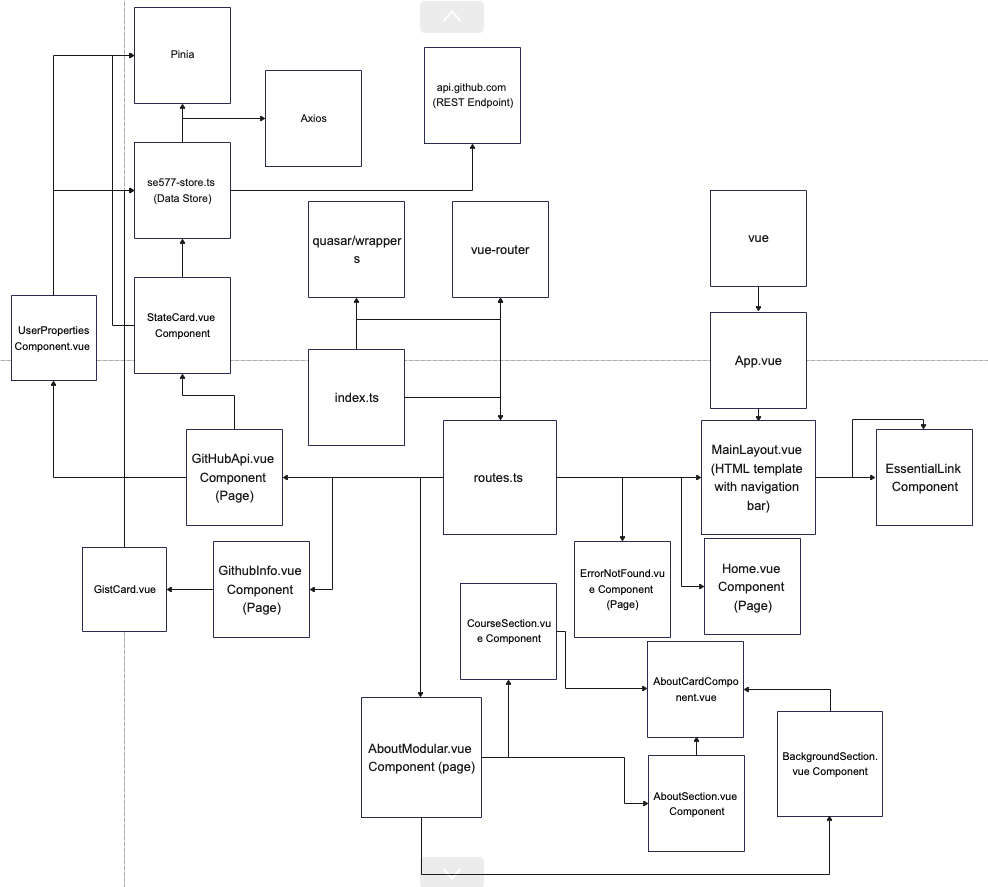

<<<<<<< Updated upstream
## Unable to setup Docker
-** I was unable to configure docker to run the Vue application via Dockerfile. **

Previous setup instructions:
        - Pull code from proj-release-2 branch (https://github.com/rohitb5/SE577-SoftwareArchitecture/tree/proj-Release-3) and install dependencies via 'npm install' or 'yarn install'
        - Run 'quasar dev' from terminal of project directory
        - Afterwards a web browser should come up, navigate to 'Github API' option on the top section of the page right below the nav bar http://localhost:8080/github_api
        - Select 'LOAD FROM TEST' option and the form should update with data from the datastore (3 sample repos)
        - Select 'RESET'
        - Select 'LOAD FROM GITHUB' option, this will display 30 repos from the GitHub account that is currently entered 'ArchitectingSoftware'
        - Update the 'GitHub ID' field on the form to another GitHub account or enter in 'rohitb5' as another test and then select 'LOAD FROM GITHUB'
=======
## How to run Application via Docker
- Pull code from proj-release-3 branch (https://github.com/rohitb5/SE577-SoftwareArchitecture/tree/proj-Release-3) 
- Go to project directory via command prompt/terminal and install dependencies via 'npm install' or 'yarn install'.
- Then run 'make build-server'
- Then run 'make docker-server'
- Then run 'make docker-run'
- Afterwards you can go to a web browser and navigate to: 
    http://localhost:9080 
- 'Github API' option on the top section of the page right below the nav bar http://localhost:9080/github_api
- Select 'LOAD FROM TEST' option and the form should update with data from the datastore (3 sample repos)
- Select 'RESET'
- Select 'LOAD FROM GITHUB' option, this will display 30 repos from the GitHub account that is currently entered 'ArchitectingSoftware'
- Update the 'GitHub ID' field on the form to another GitHub account or enter in 'rohitb5' as another test and then select 'LOAD FROM GITHUB'
>>>>>>> Stashed changes

# Updated Architecture Model 

# Narratives about state of current system Arch
- Default state loads SPA from app.vue and goes to the home page which displays the mainlayout template and router navigation options. The state of home and router changes based onhover actions which update the styling via the css based on the action, it also goes to other pages if selected. 
- The page "About Me" only has one state that displays its content/components when navigated too via the router.
- "GitHub Info" displays 2 components, first one reacts to click action to display a source URL. The other expands similarity to the first component but watches for state changes in the text box to display a button component that displays when clicked on to display a URL. The state of displaying the URL for that component changes based on the button press. 
- "GitHub API" page default state displays a form component with buttons. Each field on the form can be modified and have there state updated. No action is taken on the form to interact with the rest of the system until action is taken from either the "Load from GitHub" button or "load from Test" buttons, when either is pressed the Data store gets queried for results to display back on the form to update its state. The "RESET" button updates the "Local Test Field" back to its default state. The "Load from Test" option pulls data from the store then updating the forms state to display the data. The "Load from GitHub" option passing in the GitHub ID field from the form to query the datastore which in turn queries the GitHub API endpoint, when a response is received the state of the form gets updated to display all public repos of the GitHub ID entered. 
